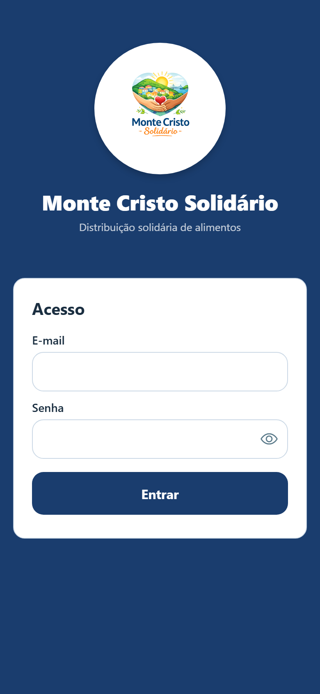
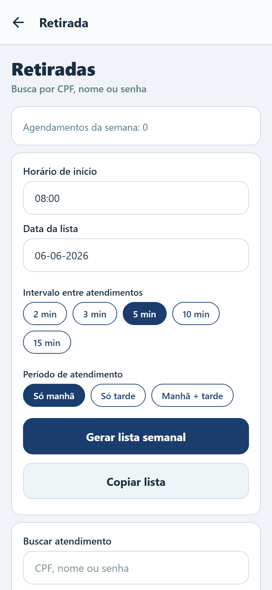
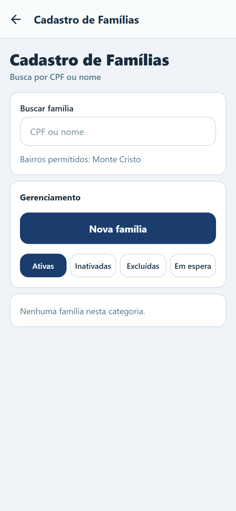
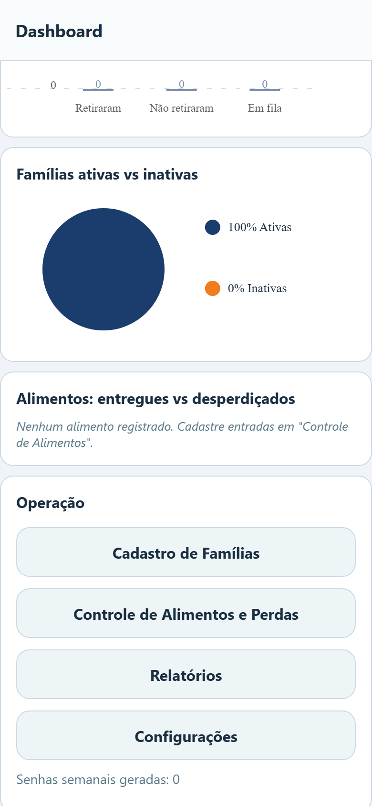
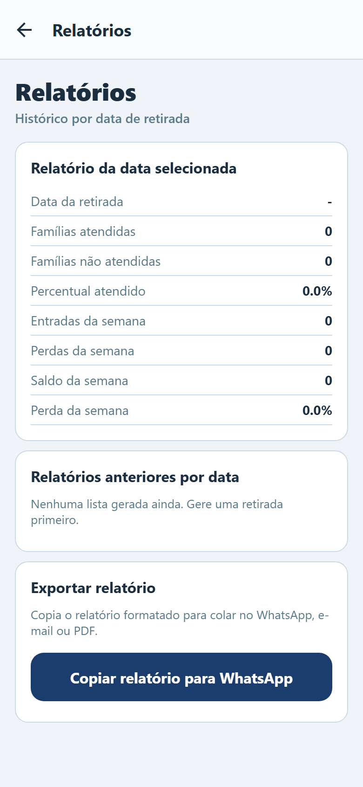
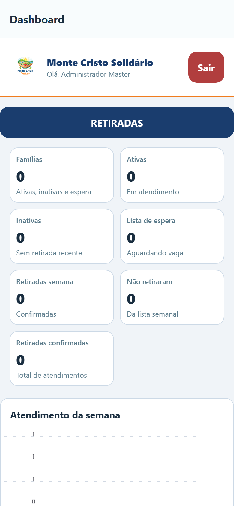

UniFECAF

Taboão da Serra

Curso Superior de Tecnologia em Análise e Desenvolvimento de Sistemas

Kevin Maikon Caetano de Andrade Santos

Monte Cristo Solidário

Evidências de Validação e Funcionamento do Sistema

Documento de evidências apresentado como complemento da Parte II da disciplina Projeto Prático — Extensão Curricularizada Tech, do Curso Superior de Tecnologia em Análise e Desenvolvimento de Sistemas da UniFECAF — Taboão da Serra.

Taboão da Serra

2026

# Evidências de Validação e Funcionamento

**Projeto:** Monte Cristo Solidário  
**Autor:** Kevin Maikon Caetano de Andrade Santos  
**Curso:** Análise e Desenvolvimento de Sistemas — UniFECAF — Taboão da Serra  
**Parceira:** Cozinha Mãe — Associação Revolução dos Baldinhos  
**Data:** Junho de 2026

---

## 1. Objetivo deste documento

Reunir **evidências visuais e registros de validação** do aplicativo Monte Cristo Solidário, conforme exigido na **Unidade 4 (Parte II)** da disciplina: comprovar que a solução é funcional e que foi apresentada/testada com a instituição parceira.

---

## 2. Metodologia de registro

| Etapa | Descrição |
|-------|-----------|
| Desenvolvimento local | App executado com `npm start` (Expo Web em `localhost:8082`) |
| Captura de telas | Screenshots automáticos das principais funcionalidades |
| Apresentação à gestora | Esboço e protótipo navegável mostrados à Cíntia Aldaci da Cruz |
| Validação de fluxos | Teste dos módulos de cadastro, retirada, alimentos e relatórios |

---

## 3. Registro de apresentação à instituição parceira

**Participante institucional:** Cíntia Aldaci da Cruz — presidente da Associação Revolução dos Baldinhos e responsável pela Cozinha Mãe.

**O que foi apresentado:**

- Diagnóstico das dores observadas em janeiro/2026 (fichas físicas, filas, duplicidade de retirada)
- Esboço das telas e fluxo do aplicativo
- Protótipo navegável no celular (Expo Go) e na versão web

**Resultado da apresentação:**

- A gestora **aprovaria a direção do projeto**
- Destacou utilidade da **geração digital de senhas** e do **controle de quem já retirou**
- Reforçou necessidade de interface **simples para voluntários**

> **Evidência complementar sugerida:** se possuir print de conversa ou foto da apresentação, anexar na entrega da disciplina.

---

## 4. Prints do aplicativo funcionando

As imagens abaixo foram capturadas do app em execução real (dados de demonstração), em junho de 2026.

### 4.1 Tela de Login

Acesso com perfil Master para operação administrativa.

*Figura 1 — Tela de login do Monte Cristo Solidário*

---

### 4.2 Dashboard — Visão geral

Indicadores de famílias, retiradas da semana, fila de espera e atalho para RETIRADAS.

*Figura 2 — Dashboard com indicadores operacionais*

---

### 4.3 Módulo de Retiradas — Configuração

Tela para definir data, horários e gerar a lista semanal de senhas (substitui fichas físicas).

*Figura 3 — Configuração da lista de retiradas*

---

### 4.4 Módulo de Retiradas — Lista gerada

Lista automática de senhas com horários para o dia selecionado.

*Figura 4 — Lista semanal de senhas gerada pelo sistema*

---

### 4.5 Cadastro de Famílias

Busca por CPF/nome, abas por status (ativas, inativas, espera) e gestão de vagas.

*Figura 5 — Cadastro e gestão de famílias*

---

### 4.6 Controle de Alimentos

Registro de caixas recebidas, perdas e visão do estoque semanal.

*Figura 6 — Controle de alimentos e perdas*

---

### 4.7 Relatórios

Comparativo semanal de retiradas, famílias e perdas.

*Figura 7 — Relatórios semanais*

---

### 4.8 Dashboard — Operação e gráficos

Visão completa com gráficos de atendimento e atalhos operacionais.

*Figura 8 — Dashboard com gráficos de atendimento*

---

## 5. Fluxos validados

| Fluxo | Status | Evidência |
|-------|--------|-----------|
| Login master/admin | ✅ Funcional | Figura 1 |
| Visualização de indicadores | ✅ Funcional | Figuras 2 e 8 |
| Geração de lista com senhas | ✅ Funcional | Figuras 3 e 4 |
| Cadastro e busca de famílias | ✅ Funcional | Figura 5 |
| Controle de alimentos/perdas | ✅ Funcional | Figura 6 |
| Relatório semanal | ✅ Funcional | Figura 7 |
| Apresentação à gestora Cíntia | ✅ Realizada | Seção 3 |

---

## 6. Conclusão

As evidências demonstram que o **Monte Cristo Solidário** é uma solução **funcional e navegável**, com módulos que respondem às dores diagnosticadas na Cozinha Mãe. Os prints comprovam o funcionamento técnico; a apresentação à gestora comprova o alinhamento com a instituição parceira.

---

**Kevin Maikon Caetano de Andrade Santos**  
UniFECAF — Taboão da Serra, 2026.
